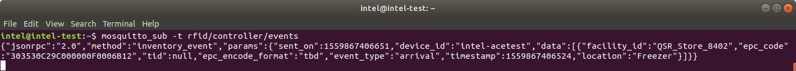
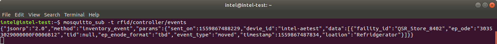
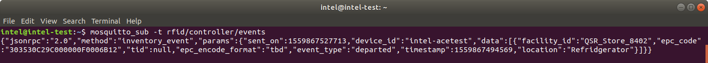

# Quick Serve Restaurant (QSR) Use Case - H1000

This use case demonstrates configuring the Intel&reg; RSP H1000 Devkit Sensor and Intel&reg; RSP 
Controller Application as deployed in a typical quick serve restaurant (qsr) environment.

## Goals
- Manage a deployment with two separate cold storage rooms, using one H1000 sensor and two antennas
  - This will be done by assigning a different alias to each antenna port
- Know when tagged items come into either cold room
- Determine the location of a tagged item (sensor and facility)
  - This will be done by setting a facility for the sensor and the aliases for the antenna ports
- Know when items potentially move between the cold rooms
  - Using different aliases for the different antennas will generate events when tags move between them
- Know when items leave either of the cold rooms
  - This will be done by setting the personality of the sensor to EXIT to determine tag departures
  
By the end of the example, you will be able to track tags as they move in and out of the different 
cold rooms.


## Prerequisites
1. You have an [H1000 DevKit](https://www.atlasrfidstore.com/intel-rsp-h1000-rfid-reader-development-kit/), 
or an equivalent setup.

2. You have completed the setup described in the 
[Getting Started Guide](https://software.intel.com/en-us/get-started-with-intel-rfid-sensor-platform-on-linux).

3. The Intel&reg; RSP Controller application (hereafter referred to as RSP Controller) is running.

4. The H1000 sensor (with two antennas attached to the first two antenna ports) is connected to the RSP Controller.

5. All RFID tags are hidden.  You can hide the tags by enclosing them in some metallic material, like a metal 
box or some aluminum foil.  You can also hide the tags under a laptop or computer.  Make sure no tags are 
visible to the sensor in order to see the complete use case scenario.

6. One RFID tag has been separated out for testing.  From the hidden tags, separate out one tag to use for this 
use case.  Make sure to choose a tag that is labeled with its EPC value, so that it will be easy to reference 
when you run through the tag movement/tracking exercise later.  Hide this tag as well, but keep it hidden 
separately from the other tags.  This will prevent all of the other tags from accidentally being introduced to 
the system when pulling out the tag for testing.

7. The antennas are positioned in an optimal setting.  Face them away from each other, point them in different 
directions, and space them at least 3-5 feet apart.


## Terminology and Concepts
| Term | Definition |
| :------ | :------ |
| Project Directory | This is the directory where the cloned rsp-sw-toolkit-gw repo contents reside (the default location is ~/projects/).  This directory contains this file and the files needed to do this use-case.  In the following instructions, the default location will be used. |
| Deploy Directory | This is the directory where the Intel&reg; RSP Controller Application gets deployed (the default location is ~/deploy/).  In the following instructions, the default location will be used. |
| Sensor/Device ID | This is the unique identifier for each sensor.  The ID consists of "RSP-" followed by the last 6 characters of that sensor's MAC address.  The MAC Address is located on the sensor's label.  Based on the following image, the sensor ID would be RSP-1508e4.   |
| Personality | This is an optional attribute that can be assigned to the sensors. It is utilized by the RSP Controller to generate specific types of tag events. |
| Alias | An alias can be used to identify a specific sensor/antenna-port combination.  This tuple is used to identify the location of tags in the inventory. The alias allows you to give meaningful names (like DryGoods or Freezer) for the locations as opposed to using sensor and antenna IDs.  The default value is the sensor ID followed by a hyphen followed by the antenna port number, for example RSP-1508e4-0. |
| Facility | This is used to define zones that consist of one or more sensors.  A typical deployment/location will consist of one facility. |
| Behavior | A collection of low-level RFID settings that dictates how the sensor operates. |
| Cluster | A grouping of one or more sensors that share the same set of configurations (facility, personality, alias, and behavior). |
| Tag State | A particular condition that describes the tag's current status.  The most common states for tags are present, exiting, and departed. |
| Tag Event | This is generated when a tag transitions between states.  The most common events are arrival, departed, and moved. |

## Configure / Control the Intel&reg; RSP Controller Application
To configure and use the RSP Controller, one of the main components is the cluster file.  The cluster 
file specifies 
- How sensors should be grouped together
- The facility(ies) to be used
- What aliases should be assigned to the sensors' antenna ports (for unique/custom location reporting using meaningful names)
- Which personalities (if any) should be assigned to the sensors
- Which behavior settings should be used

### Cluster Configuration
You will need to edit the [DevkitQsrCluster.json](./DevkitQsrCluster.json) file (located at ~/projects/rsp-sw-toolkit-gw/examples/use-cases/qsr/h1000/) with new values to set up this use case: we want a single facility; two different aliases, one for each antenna (Freezer and Refrigerator); an EXIT personality; and the appropriate behaviors.
1. Open the file in your favorite editor.  You will see that the file is JSON formatted and consists of a cluster configuration ID and a list of clusters.  You will need to insert the appropriate values for each cluster.

2. Edit the various fields to configure the clusters.  The following steps explain each line of the cluster.
    1. __id__: This is a unique ID used to identify this cluster.  You can leave the default value.
    2. __personality__: Since we want to know when tags leave any of our locations, we want to set the personality to EXIT.  This will generate a "departed" event whenever a tag is removed from any of the locations.
        ```json
        "personality": "EXIT",
        ```
    3. __facility_id__: For most purposes, a single facility is needed to encompass a deployment at a store.  We will give it the value of our imaginary store's ID.
        ```json
        "facility_id": "QSR_Store_8402",
        ```
    4. __aliases__: This is the central configuration piece for setting meaningful names for locations.  In this use case, we're looking to set two locations: the Freezer location, and the Refrigerator location.  We'll assign the antenna hooked up to the first port to be the Freezer location, and the antenna hooked up to the second port to be the refrigerator location.  

        __NOTE: The order of the aliases matters.  The first alias will get assigned to the antenna hooked up to the first port, the second alias will be assigned to the antenna hooked up to the second port, etc.  If a value is not specified for a port, then the default alias is used (see the "Alias" term in the [Terminology and Concepts section](#terminology-and-concepts).__
        ```json
        "aliases": [ "Freezer", "Refrigerator" ],
        ```
    5. __behavior_id__: Behaviors are the central configuration piece for the low level RFID configuration settings.  The RSP Controller comes with some preset behavior files, but for this use-case, we will use a custom one by setting the behavior_id to DevkitQsrBehaviorExit_PORTS_2.
        ```json
        "behavior_id": "DevkitQsrBehaviorExit_PORTS_2",
        ```
    6. __sensor_groups__: This is where you set which sensors will be governed by the settings that we just configured.  This is a list of sensor groupings.  All sensors in each group will run at the same time, and each group will run in sequence.  Thus, if you have sensors that would interfere with each other (they cover the same area, they are facing each other, etc.), then you can place them in different groups so that they aren't running at the same time.  Since this use-case is very simple, we will have one sensor group with  only a single sensor in it.  __A sample sensor ID is used below, but for proper functionality, you will have to use your actual sensor's ID.__  To find the sensor ID of your sensor, see the "Sensor/Device ID" term in the [Terminology and Concepts section](#terminology-and-concepts).  

        __NOTE: The sensor ID is case sensitive, so make sure the "RSP" portion is capitalized and any other alphabetical characters are lowercase.__
        ```json
        "sensor_groups": [["RSP-150004"]]
        ```

3. If done correctly, your cluster configuration file should now look like the following, except with your correct sensor ID:
    ```json
    {
      "id": "QsrUseCaseClusterConfigExample",
      "clusters": [
        {
          "id": "ColdAreaCluster",
          "personality": "EXIT",
          "facility_id": "QSR_Store_8402",
          "aliases": [ "Freezer", "Refrigerator" ],
          "behavior_id": "DevkitQsrBehaviorExit_PORTS_2",
          "sensor_groups": [["RSP-150004"]]
        }
      ]
    }
    ```

4. Now that the file is complete, it would be a good idea to pass the contents of the file through a JSON linter (such as https://jsonlint.com/, which is a convenient online JSON linting tool) to ensure your file has proper JSON formatting.

5. Save and close the updated cluster configuration file.

6. (Optional) This would be a good time to label your physical antennas with the aliases that you set in the cluster configuration file.  This will help make it easier to follow and understand the output when you go through the tag movement/tracking exercise.

7. Choose one of the following methods to configure and control the RSP Controller. Each method will accomplish 
the same configuration tasks.

    - [METHOD 1: Using the Web Admin](#method-1-using-the-web-admin)
    - [METHOD 2: Using the MQTT Messaging API](#method-2-using-the-mqtt-messaging-api)

___

### METHOD 1: Using the Web Admin
1. Open the [web admin](http://localhost:8080/web-admin) page and confirm that the sensor included in the 
devkit is connected. This can be seen on the [dashboard](http://localhost:8080/web-admin/dashboard.html) 
page or the [sensors](http://localhost:8080/web-admin/sensors-main.html) page.  You can navigate between 
the different pages by using the menu button found at the top left of each page.

    

2. On the [scheduler](http://localhost:8080/web-admin/scheduler.html) page, stop the sensor from reading 
tags by pressing the INACTIVE button.

    

3. On the [inventory](http://localhost:8080/web-admin/inventory-main.html) page, press the Unload button 
to clear out all previous tag history to start a clean session.

    

4. On the [behaviors](http://localhost:8080/web-admin/behaviors.html) page, use the Upload From File
button to upload the use case behavior to the RSP Controller.

    

    The behavior file can be found at 
    ~/projects/rsp-sw-toolkit-gw/examples/use-cases/qsr/h1000/DevkitQsrBehaviorExit_PORTS_2.json.

    __NOTE:__  This file __MUST__ be loaded to the RSP Controller __BEFORE__ the cluster configuration 
    because the cluster file references that behavior id, and that behavior must already be known by the 
    RSP Controller. Otherwise the loading of the cluster configuration file will fail validation.

5. Upload the __EDITED__ cluster configuration file (see the [Cluster Configuration section](#cluster-configuration)) 
using the [cluster config](http://localhost:8080/web-admin/cluster-config.html) page.

    

    The cluster configuration file can be found at 
    ~/projects/rsp-sw-toolkit-gw/examples/use-cases/qsr/h1000/DevkitQsrCluster.json.

6. On the [scheduler](http://localhost:8080/web-admin/scheduler.html) page, start the sensor reading 
according to the cluster configuration by pressing the FROM_CONFIG button.

    
    
    The clusters that the scheduler is using will be displayed on the page.

7. On the [sensors](http://localhost:8080/web-admin/sensors-main.html) page, confirm that the sensor has 
been configured as specified in the cluster configuration file (has the correct behavior, facility, personality, 
and aliases) and is reading tags.

8. Navigate to the [inventory](http://localhost:8080/web-admin/inventory-main.html) page which can be used 
to monitor tag reads and states.

9. Continue to the [Observe Tag Events section](#observe-tag-events).
___

### METHOD 2: Using the MQTT Messaging API
1. Edit [cluster_set_config_request_use_case_qsr.json](./cluster_set_config_request_use_case_qsr.json) 
replacing "CONTENTS_OF_CLUSTER_CONFIG_GO_HERE" with the contents of the edited DevkitQsrCluster.json file. 

2. Open a terminal window and subscribe to the RSP Controller's command response topic in order to monitor the 
command responses.
    ```bash
    #-- monitor the rpc command responses
    mosquitto_sub -t rfid/controller/response
    ```

3. Open another terminal to send JsonRPC commands over MQTT to configure and control the RSP Controller.
    ```bash
    #-- change directory to the examples folder 
    #-- so the example commands work correctly
    cd ~/projects/rsp-sw-toolkit-gw/examples
    
    #-- stop the scheduler
    mosquitto_pub -t rfid/controller/command -f api/upstream/scheduler_set_run_state_request_INACTIVE.json
    
    #-- unload the current inventory
    mosquitto_pub -t rfid/controller/command -f api/upstream/inventory_unload_request.json
    
    #-- load the behavior specific to this exercise
    #-- (lowered power level as antennas are likely to be interfering)
    mosquitto_pub -t rfid/controller/command -f use-cases/qsr/h1000/behavior_put_request_Exit.json
    
    #-- load (set) the cluster configuration
    mosquitto_pub -t rfid/controller/command -f use-cases/qsr/h1000/cluster_set_config_request_use_case_qsr.json
    
    #-- activate the scheduler in custom configuration mode
    mosquitto_pub -t rfid/controller/command -f api/upstream/scheduler_set_run_state_request_FROM_CONFIG.json
    ```

4. Continue to the [Observe Tag Events section](#observe-tag-events).
___

## Observe Tag Events
Open a terminal window and subscribe to the RSP Controller events MQTT topic in order to monitor tag events 
as produced by the RSP Controller.

```bash
#-- monitor the upstream events topic
mosquitto_sub -t rfid/controller/events
```

__NOTE:__  All of the output seen below is based on the default values from the included configuration files.  
If you changed the default values, your results may differ slightly.

1. ### Tag arrival in the first cold room
    At this point, remove one tag from hiding and place it nearby one of the two antennas. When the tag is  
    read initially, an arrival event will be generated on the rfid/controller/events MQTT topic. 
    Verify from the Web Admin 
    [inventory](http://localhost:8080/web-admin/inventory-main.html) page that the tag is now in the 
    EXITING state and the location is at the first antenna's alias (either Freezer or Refrigerator).

    Verify the receipt of the MQTT event message.
    
    ```json
    {
      "jsonrpc": "2.0",
      "method": "inventory_event",
      "params": {
        "sent_on": 1559867406651,
        "device_id": "intel-acetest",
        "data": [
          {
            "facility_id": "QSR_Store_8402",
            "epc_code": "303530C29C000000F0006B12",
            "tid": null,
            "epc_encode_format": "tbd",
            "event_type": "arrival",
            "timestamp": 1559867406524,
            "location": "Freezer"
          }
        ]
      }
    }
    ```

    If you do not see the expected event, please confirm that
    - The cluster file was edited properly with the correct sensor ID (see the [Cluster Configuration 
    section](#cluster-configuration))
    - The cluster file was uploaded correctly
    - The scheduler is using that cluster configuration

2. ### Tag moved to the other cold room
    Now take the tag and move it to the other antenna. Since these antennas are in the same facility, a 
    moved event will be generated. It may take a few moments for the event to be generated as the 
    algorithm uses time-weighted RSSI averages to determine tag location. From the 
    [inventory](http://localhost:8080/web-admin/inventory-main.html) page, confirm that the tag's location 
    has changed to the other cold room.

    Verify the receipt of the MQTT event message.
    
    ```json
    {
      "jsonrpc": "2.0",
      "method": "inventory_event",
      "params": {
        "sent_on": 1559867488229,
        "device_id": "intel-acetest",
        "data": [
          {
            "facility_id": "QSR_Store_8402",
            "epc_code": "303530C29C000000F0006B12",
            "tid": null,
            "epc_encode_format": "tbd",
            "event_type": "moved",
            "timestamp": 1559867487834,
            "location": "Refrigerator"
          }
        ]
      }
    }
    ```

3. ### Tag departure from the second cold room
    Now take the tag and hide it such that it can't be seen by either antenna.  After the departure 
    threshold time limit has passed (default being 30 seconds), a departed event should be generated 
    for the tag that was removed.  From the [inventory](http://localhost:8080/web-admin/inventory-main.html) 
    page, confirm that the tag state of the removed tag has changed to DEPARTED_EXIT.  
    
    Verify the receipt of the MQTT event message.
    
    ```json  
    {
      "jsonrpc": "2.0",
      "method": "inventory_event",
      "params": {
        "sent_on": 1559867527713,
        "device_id": "intel-acetest",
        "data": [
          {
            "facility_id": "QSR_Store_8402",
            "epc_code": "303530C29C000000F0006B12",
            "tid": null,
            "epc_encode_format": "tbd",
            "event_type": "departed",
            "timestamp": 1559867494569,
            "location": "Refrigerator"
          }
        ]
      }
    }
    ```

## Starting a Clean Session
If you would like to start another use case, try another configuration method, or would like to run 
your own scenario, then you will want to start with a clean session for the RSP Controller so that 
old data and configurations do not pollute your next exercise.  In order to do this, follow these steps:

1. Stop the RSP Controller.  If you used the installer to install the RSP Controller, and you used 
the native installation (non-Docker method), then simply press Ctrl+C in the terminal window where 
you ran the installer script.

2. Run the following commands to clear out the old data and configurations
    ```bash
    cd ~/deploy/rsp-sw-toolkit-gw/cache/
    rm -rf *.json
    ```

3. Start the RSP Controller by running the following commands
    ```bash
    cd ~/deploy/rsp-sw-toolkit-gw/
    ./run.sh
    ```

Now you should have a clean session from which you can run any new scenario without worry of data 
or configuration pollution.