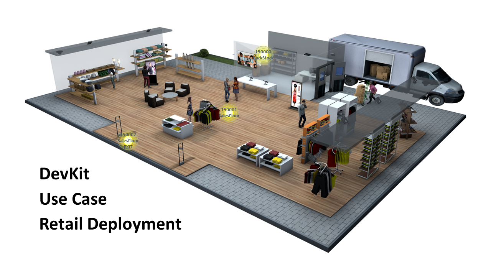

This use case demonstrates configuring the Intel&reg; RSP Devkit Sensors and Intel&reg; RSP Controller Application as deployed in 
a typical retail envinronment.

## Goals  
- Manage a deployment with two separate facilities of interest ... BackStock and SalesFloor
- Know when tagged items come into the store in either facility
- Know the location of a tagged item (sensor and facility)
- Know when a tagged item has moved from the BackStock to the SalesFloor or vice-versa
- Know when a tagged item has left the store
  
By the end of the example, you will be able to track a tag as it arrives into the BackStock, 
transitions to the SalesFloor, and then departs out the front door of the store.
  
## Prerequsites  
1. It is assumed that the controller is already running and the sensors are running and connected to the controller.

2. The directory structure is consistent for source ($HOME/projects/rsp-sw)
3. Edit [DevkitRetailCluster.json](./DevkitRetailCluster.json) sensor device ids in the sensor_groups 
to match the sensors included with the DevKit.  
This cluster configuration file is an example that 
establishes the two facilities of interest (BackStock, SalesFloor), 
configures one sensor to be in the BackStock and two sensors in the SalesFloor, 
assigns one SalesFloor sensor as an EXIT reader in order to detect when tags have gone out the front entrance, 
and assigns appropriate behaviors for reading RFID tags.  

3. Hide the Tags  
Make sure no tags are visible to the sensors in order to see a complete use case scenario.

## Configure / Control the Intel&reg; RSP Controller Application
After ther prerequisites have been met, choose one of the following methods to configure and 
control the application. Each method accomplishes the same configuration tasks.
- Using the Web Admin
- Using the Command Line Interface (CLI)
- Using the MQTT Messaging API

___

### USING THE WEB ADMIN
1. Open the [web admin](http://localhost:8080/web-admin) page and confirm that the sensors
included in the dev kit are connected. This can be seen on the 
[dashboard](http://localhost:8080/web-admin/dashboard.html)
or [sensors](http://localhost:8080/web-admin/sensors-main.html) pages.

2. On the [scheduler](http://localhost:8080/web-admin/scheduler.html) page, 
stop the sensors from reading by selecting the INACTIVE run state.

3. On the [behaviors](http://localhost:8080/web-admin/behaviors.html) page, use the Upload From File
button to upload all of the use case behaviors to the controller. The behavior files can be found at 
~/projects/rsp-sw-toolkit-gw/examples/use-cases/retail/DevkitRetailBehavior*.json.  

    These __MUST__ be loaded to the controller __BEFORE__ the cluster configuration because the cluster
    file references those behavior ids, and the behaviors must already be known by the controller. Otherwise
    the loading of the cluster configuration file will fail validation.

4. Upload the __edited__  (see Prerequistes) cluster configuration file using the 
[cluster config](http://localhost:8080/web-admin/cluster-config.html) page.

5. On the [scheduler](http://localhost:8080/web-admin/scheduler.html) page, 
start the sensors reading according to the cluster configuration by 
selecting the FROM_CONFIG run state. The clusters that the scheduler is using will be displayed
on the page.

6. On the [sensors](http://localhost:8080/web-admin/sensors-main.html), confirm that the sensors
have been configured as expected and are reading tags according to the cluster configuration file.

7. Navigate to the [inventory](http://localhost:8080/web-admin/inventory-main.html) which can be used
to monitor tag reads and states.

Continue to Observe Tag Events Section
___
  
### USING THE CLI
1. Open a terminal window
2. Copy the use case behaviors to the deployed controller so they are available for use
    ```bash
    cd ~/projects/rsp-sw-toolkit-gw/examples/use-cases/retail/
    cp DevkitRetailBehavior*.json ~/deploy/rsp-sw-toolkit-gw/config/behaviors/
    ```
3. Connect to the controller's command line interface and execute the following series of commands.
    ```bash
    ssh -p5222 console@localhost
    password: console
        
    #-- stop the scheduler
    cli> scheduler set.run.state INACTIVE 
    ------------------------------------------
    completed
    ------------------------------------------
    
    #-- unload the current inventory
    cli> inventory unload 
    ------------------------------------------
    unload complete
    ------------------------------------------
    
    #-- load the cluster configuration
    cli> clusters load.file ../../projects/rsp-sw-toolkit-gw/examples/use-cases/retail/DevkitRetailCluster.json
    ------------------------------------------
    completed
    ------------------------------------------
    
    #-- activate the scheduler in custom configuration mode
    cli> scheduler set.run.state FROM_CONFIG 
    ------------------------------------------
    completed
    ------------------------------------------

    #-- confirm the configuration is active 
    cli> scheduler show 
    ------------------------------------------
    runState: FROM_CONFIG
    ------------------------------------------
    clusters:
          id: BackStockCluster
    behavior: ClusterDeepScan_PORTS_1
    sensors: [RSP-150005 ]
    
    ------------------------------------------
          id: SalesFloorCluster
    behavior: ClusterMobility_PORTS_1
    sensors: [RSP-150000 ]
    
    ------------------------------------------
          id: SalesFloorExitCluster
    behavior: ClusterExit_PORTS_1
    sensors: [RSP-150004 ]
    
    ------------------------------------------
    ```

Continue to Observe Tag Events Section
___

### USING MQTT:
1. Edit [cluster_set_config_request_use_case_retail.json](./cluster_set_config_request_use_case_retail.json) 
replacing "CONTENTS_OF_CLUSTER_CONFIG_GO_HERE" with the contents of the DevkitRetailCluster.json file. 

2. Open a terminal window and subscribe to the controller command response topic in order to monitor the command responses
    ```bash
    #-- monitor the rpc command responses
    mosquitto_sub -t rfid/controller/response
    ```
3. Open a terminal to send JsonRPC commands over MQTT to configure and control the controller.
    ```bash
    #-- change directory to the examples folder 
    #-- so the example commands work correctly
    cd ~/projects/rsp-sw-toolkit-gw/examples
    
    #-- stop the scheduler
    mosquitto_pub -t rfid/controller/command -f api/upstream/scheduler_set_run_state_request_INACTIVE.json
    
    #-- unload the current inventory
    mosquitto_pub -t rfid/controller/command -f api/upstream/inventory_unload_request.json
    
    #-- load behaviors specific to this exercise
    #-- (lowered power levels as sensors are likely interferring)
    mosquitto_pub -t rfid/controller/command -f use-cases/retail/behavior_put_request_DeepScan.json
    mosquitto_pub -t rfid/controller/command -f use-cases/retail/behavior_put_request_Exit.json
    mosquitto_pub -t rfid/controller/command -f use-cases/retail/behavior_put_request_Mobility.json
    
    #-- load (set) the cluster configuration
    mosquitto_pub -t rfid/controller/command -f use-cases/retail/cluster_set_config_request_use_case_retail.json
    
    #-- activate the scheduler in custom configuration mode
    mosquitto_pub -t rfid/controller/command -f api/upstream/scheduler_set_run_state_request_FROM_CONFIG.json
    ```

Continue to Observe Tag Events Section
___

## Observe Tag Events
Check that the sensors are not pointed in conflicting directions as much as possible. 
(The H3000 and H4000 antennae are directional).

Open a terminal window and subscribe to the controller events topic in order to monitor 
tag events as produced by the controller.

```bash
#-- monitor the upstream events topic
mosquitto_sub -t rfid/controller/events
```

1. ##### Tag arrival in BackStock
    At this point, remove a tag from hiding and place it nearby the BackStock sensor. 
    When the tag is read initially an arrival event will be generated on the rfid/controller/events topic.
    Verify from the Web Admin 
    [inventory](http://localhost:8080/web-admin/inventory-main.html) page that the tag is now PRESENT
    and the location is at the BackStock sensor.  
    Verify receipt of the event messag on mqtt
    ```json
    {
      "jsonrpc": "2.0",
      "method": "inventory_event",
      "params": {
        "sent_on": 1559867406651,
        "device_id": "intel-acetest",
        "data": [
          {
            "facility_id": "BackStock",
            "epc_code": "303530C29C000000F0006B12",
            "tid": null,
            "epc_encode_format": "tbd",
            "event_type": "arrival",
            "timestamp": 1559867406524,
            "location": "RSP-150994-0"
          }
        ]
      }
    }
    ```    

2. ##### Tag departure from BackStock and arrival in SalesFloor
    Now move the tag from the BackStock sensor to the non-exit SalesFloor sensor. Since these sensors are in different facilities
    the events generated will be a 'departure' from BackStock and an 'arrival' into SalesFloor. It may take a few moments for the event(s)
    to be generated as the algorithm uses time-weighted RSSI averages to determine tag location.
    Again, monitor the events and / or 
    [inventory](http://localhost:8080/web-admin/inventory-main.html) page 
    to confirm the location is the second sensor.
    ```json  
    {
      "jsonrpc": "2.0",
      "method": "inventory_event",
      "params": {
        "sent_on": 1559867429368,
        "device_id": "intel-acetest",
        "data": [
          {
            "facility_id": "BackStock",
            "epc_code": "303530C29C000000F0006B12",
            "tid": null,
            "epc_encode_format": "tbd",
            "event_type": "departed",
            "timestamp": 1559867428832,
            "location": "RSP-150994-0"
          },
          {
            "facility_id": "SalesFloor",
            "epc_code": "303530C29C000000F0006B12",
            "tid": null,
            "epc_encode_format": "tbd",
            "event_type": "arrival",
            "timestamp": 1559867429172,
            "location": "RSP-1508ec-0"
          }
        ]
      }
    }
    ```

3. ##### Tag is purchased and heading out the front door 
    Now move the tag to the Exit sensor and from the 
    [inventory](http://localhost:8080/web-admin/inventory-main.html) page
    confirm that the tag state has changed to EXITING.
    At this point, the tag is eligible to generate a departure event if it is not
    read by a sensor within  30 seconds. 
    ```json  
    {
      "jsonrpc": "2.0",
      "method": "inventory_event",
      "params": {
        "sent_on": 1559867488229,
        "device_id": "intel-acetest",
        "data": [
          {
            "facility_id": "SalesFloor",
            "epc_code": "303530C29C000000F0006B12",
            "tid": null,
            "epc_encode_format": "tbd",
            "event_type": "moved",
            "timestamp": 1559867487834,
            "location": "RSP-150a8e-0"
          }
        ]
      }
    }
    ```

4. ##### Tag departs
    Hide the tag so that no sensor is able to read it to emulate the tag actually being gone.
    A departure event should be generated in about 30 seconds and the tag state should change
    to DEPARTED_EXIT.  
    ```json  
    {
      "jsonrpc": "2.0",
      "method": "inventory_event",
      "params": {
        "sent_on": 1559867527713,
        "device_id": "intel-acetest",
        "data": [
          {
            "facility_id": "SalesFloor",
            "epc_code": "303530C29C000000F0006B12",
            "tid": null,
            "epc_encode_format": "tbd",
            "event_type": "departed",
            "timestamp": 1559867494569,
            "location": "RSP-150a8e-0"
          }
        ]
      }
    }
    ```