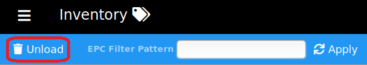
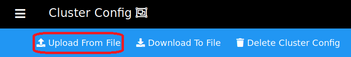

This use case demonstrates configuring the Intel&reg; RSP H3000 Devkit Sensors and Intel&reg; RSP 
Controller Application as deployed in a typical retail environment.

## Goals  
- Manage a deployment with two separate locations of interest ... BackStock and SalesFloor
- Know when tagged items come into the store in either location
- Know the location of a tagged item (sensor and facility)
- Know when a tagged item has moved from the BackStock to the SalesFloor or vice-versa
- Know when a tagged item has left the store
  
By the end of the example, you will be able to track a tag as it arrives into the BackStock, 
transitions to the SalesFloor, and then departs out the front door of the store.
  
## Prerequisites
1. It is assumed that the Intel&reg; RSP Controller application (hereafter referred to as RSP Controller) 
is already running and the sensor has its antennas attached, is running, and is connected to the RSP Controller.

2. Hide the Tags  
Make sure no tags are visible to the sensors in order to see a complete use case scenario.  You can hide the 
tags by enclosing them in some metallic material, like a metal box or some aluminum foil.  You can also hide 
the tags under a laptop or computer.

## Configure / Control the Intel&reg; RSP Controller Application
To configure and use the RSP Controller, one of the main components is the cluster file.  The cluster 
file specifies how the sensors should be grouped together, which behavior settings should be used, which 
personalities (if any) should be assigned to the sensors, and what aliases should be assigned to the sensors' 
antenna ports (for unique/custom location reporting).

__Note:__ In the following instructions, the term YOUR_PROJECT_DIRECTORY will refer to the directory where 
the cloned rsp-sw-toolkit-gw repo contents reside (the default location is ~/projects/), and the term 
YOUR_DEPLOY_DIRECTORY will refer to the directory where the Intel&reg; RSP Controller Application was 
deployed (the default location is ~/deploy/).

In the [DevkitRetailCluster.json](./DevkitRetailCluster.json) file (located at 
YOUR_PROJECT_DIRECTORY/rsp-sw-toolkit-gw/examples/use-cases/retail/h3000/), edit the sensor device ids in 
the sensor_groups to match the sensors included with the Devkit. This cluster configuration file is an 
example that establishes the two locations of interest (BackStock, SalesFloor) at a single facility 
(Retail_Store_8402), configures one sensor to be in the BackStock and the other sensor to be in the SalesFloor, 
assigns the SalesFloor sensor with an EXIT personality in order to detect when tags have gone out the front 
entrance, assigns the appropriate behaviors for reading RFID tags, and assigns appropriate aliases to the 
antenna ports for reporting tag locations by a singular sensor location as opposed to by indiviual sensor 
ports.

After the cluster file has been edited and saved, choose one of the following methods to configure and control 
the RSP Controller. Each method accomplishes the same configuration tasks.

- [METHOD 1: Using the Web Admin](#method-1-using-the-web-admin)
- [METHOD 2: Using the MQTT Messaging API](#method-2-using-the-mqtt-messaging-api)

___

### METHOD 1: Using the Web Admin
1. Open the [web admin](http://localhost:8080/web-admin) page and confirm that the sensors included in the 
dev kit are connected. This can be seen on the [dashboard](http://localhost:8080/web-admin/dashboard.html) 
page or the [sensors](http://localhost:8080/web-admin/sensors-main.html) page.  You can navigate between 
the different pages by using the menu button found at the top left of each page.

    

2. On the [scheduler](http://localhost:8080/web-admin/scheduler.html) page, stop the sensors from reading 
by pressing the INACTIVE button to set the run state to INACTIVE.

    

3. On the [inventory](http://localhost:8080/web-admin/inventory-main.html) page, press the Unload button 
to clear out all previous tag history to start a clean session.

    

4. On the [behaviors](http://localhost:8080/web-admin/behaviors.html) page, use the Upload From File
button to upload all of the use case behaviors to the RSP Controller.

    
    
    The behavior files can be found in the 
    YOUR_PROJECT_DIRECTORY/rsp-sw-toolkit-gw/examples/use-cases/retail/h3000/ directory.  The required files are:

    - DevkitRetailBehaviorDeepScan_PORTS_1.json
    - DevkitRetailBehaviorExit_PORTS_1.json

    __NOTE:__  These files __MUST__ be loaded to the RSP Controller __BEFORE__ the cluster configuration 
    because the cluster file references those behavior ids, and the behaviors must already be known by the 
    RSP Controller. Otherwise the loading of the cluster configuration file will fail validation.

5. Upload the __EDITED__ cluster configuration file (see the [Configure / Control the Intel&reg; RSP 
Controller Application section](#configure--control-the-intel-rsp-controller-application)) using the 
[cluster config](http://localhost:8080/web-admin/cluster-config.html) page.

    

6. On the [scheduler](http://localhost:8080/web-admin/scheduler.html) page, start the sensors reading 
according to the cluster configuration by selecting the FROM_CONFIG run state.

    
    
    The clusters that the scheduler is using will be displayed on the page.

7. On the [sensors](http://localhost:8080/web-admin/sensors-main.html) page, confirm that the sensors have 
been configured as specified in the cluster configuration file (have the correct behavior, facility, personality, 
and aliases) and are reading tags.

8. Navigate to the [inventory](http://localhost:8080/web-admin/inventory-main.html) page which can be used 
to monitor tag reads and states.

Continue to the [Observe Tag Events section](#observe-tag-events).
___

### METHOD 2: Using the MQTT Messaging API
1. Edit [cluster_set_config_request_use_case_retail.json](./cluster_set_config_request_use_case_retail.json) 
replacing "CONTENTS_OF_CLUSTER_CONFIG_GO_HERE" with the contents of the edited DevkitRetailCluster.json file. 

2. Open a terminal window and subscribe to the RSP Controller's command response topic in order to monitor the 
command responses.
    ```bash
    #-- monitor the rpc command responses
    mosquitto_sub -t rfid/controller/response
    ```

3. Open another terminal to send JsonRPC commands over MQTT to configure and control the RSP Controller.
    ```bash
    #-- change directory to the examples folder 
    #-- so the example commands work correctly
    cd YOUR_PROJECT_DIRECTORY/rsp-sw-toolkit-gw/examples
    
    #-- stop the scheduler
    mosquitto_pub -t rfid/controller/command -f api/upstream/scheduler_set_run_state_request_INACTIVE.json
    
    #-- unload the current inventory
    mosquitto_pub -t rfid/controller/command -f api/upstream/inventory_unload_request.json
    
    #-- load behaviors specific to this exercise
    #-- (lowered power levels as sensors are likely interferring)
    mosquitto_pub -t rfid/controller/command -f use-cases/retail/h3000/behavior_put_request_DeepScan.json
    mosquitto_pub -t rfid/controller/command -f use-cases/retail/h3000/behavior_put_request_Exit.json
    
    #-- load (set) the cluster configuration
    mosquitto_pub -t rfid/controller/command -f use-cases/retail/h3000/cluster_set_config_request_use_case_retail.json
    
    #-- activate the scheduler in custom configuration mode
    mosquitto_pub -t rfid/controller/command -f api/upstream/scheduler_set_run_state_request_FROM_CONFIG.json
    ```

Continue to the [Observe Tag Events section](#observe-tag-events).
___

## Observe Tag Events
Check that the sensors are not pointed in conflicting directions as much as possible. 
(The H3000 antennae are directional).

Open a terminal window and subscribe to the RSP Controller events topic in order to monitor 
tag events as produced by the RSP Controller.

```bash
#-- monitor the upstream events topic
mosquitto_sub -t rfid/controller/events
```

1. ##### Tag arrival in BackStock
    At this point, remove one tag from hiding and place it nearby the BackStock sensor. 
    When the tag is read initially, an arrival event will be generated on the rfid/controller/events topic.
    Verify from the Web Admin 
    [inventory](http://localhost:8080/web-admin/inventory-main.html) page that the tag is now PRESENT
    and the location is at the BackStock sensor.  
    Verify the receipt of the MQTT event message.
    ```json
    {
      "jsonrpc": "2.0",
      "method": "inventory_event",
      "params": {
        "sent_on": 1559867406651,
        "device_id": "intel-acetest",
        "data": [
          {
            "facility_id": "Retail_Store_8402",
            "epc_code": "303530C29C000000F0006B12",
            "tid": null,
            "epc_encode_format": "tbd",
            "event_type": "arrival",
            "timestamp": 1559867406524,
            "location": "BackStock"
          }
        ]
      }
    }
    ```    

2. ##### Tag departure from BackStock and arrival in SalesFloor
    Now move the tag from the BackStock sensor to the SalesFloor sensor. Since these sensors are at different 
    locations within the same facility, a "moved" event will be generated.  It may take a few moments for the 
    event to be generated as the algorithm uses time-weighted RSSI averages to determine the tag location. From 
    the [inventory](http://localhost:8080/web-admin/inventory-main.html) page, confirm that the tag has changed 
    locations to the second sensor and that the tag state has changed to EXITING.  
    Verify the receipt of the MQTT event message.
    ```json  
    {
      "jsonrpc": "2.0",
      "method": "inventory_event",
      "params": {
        "sent_on": 1559867429368,
        "device_id": "intel-acetest",
        "data": [
          {
            "facility_id": "Retail_Store_8402",
            "epc_code": "303530C29C000000F0006B12",
            "tid": null,
            "epc_encode_format": "tbd",
            "event_type": "moved",
            "timestamp": 1559867428832,
            "location": "SalesFloor"
          }
        ]
      }
    }
    ```

3. ##### Tag departs
    Hide the tag so that no sensor is able to read it to emulate the tag actually being gone.
    A departure event should be generated in about 30 seconds and the tag state should change
    to DEPARTED_EXIT.  
    Verify the receipt of the MQTT event message.
    ```json  
    {
      "jsonrpc": "2.0",
      "method": "inventory_event",
      "params": {
        "sent_on": 1559867527713,
        "device_id": "intel-acetest",
        "data": [
          {
            "facility_id": "Retail_Store_8402",
            "epc_code": "303530C29C000000F0006B12",
            "tid": null,
            "epc_encode_format": "tbd",
            "event_type": "departed",
            "timestamp": 1559867494569,
            "location": "SalesFloor"
          }
        ]
      }
    }
    ```