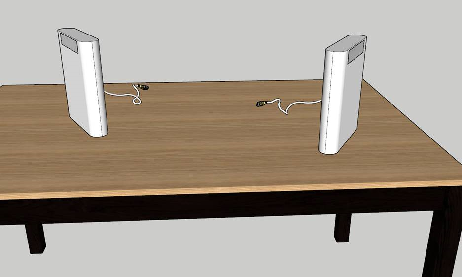
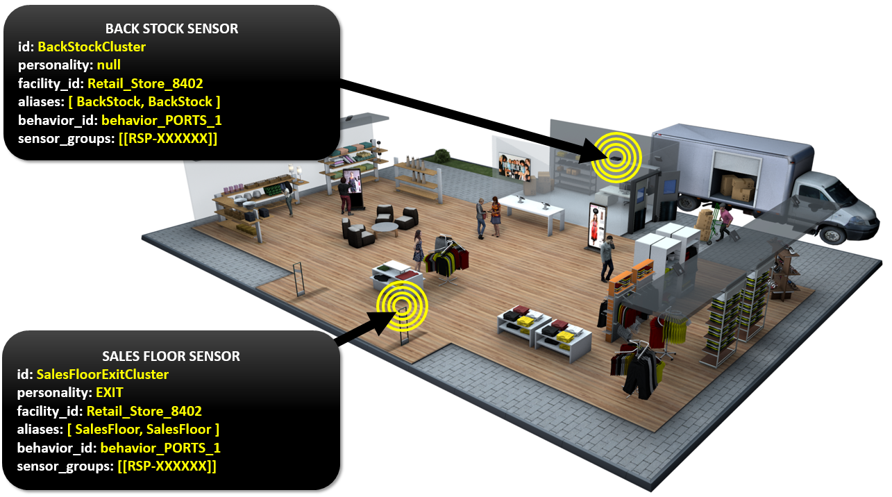
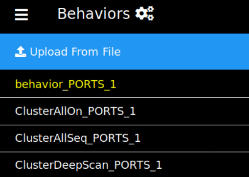
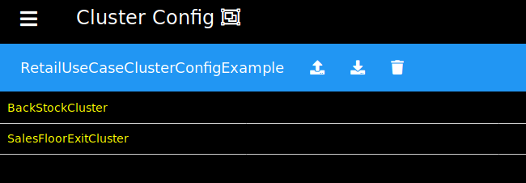
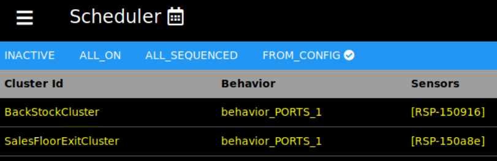
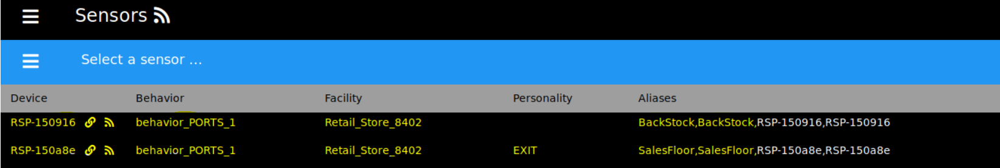

# Retail Use Case - H3000

This use case demonstrates configuring the Intel&reg; RSP H3000 Sensors and Intel&reg; RSP 
Controller Application as deployed in a typical retail environment.

## Table of Contents
1. [Goals](#goals)
2. [Prerequisites](#prerequisites)
3. [Terminology and Concepts](#terminology-and-concepts)
4. [Configure / Control the Intel&reg; RSP Controller Application](#configure--control-the-intel-rsp-controller-application)
    - [Cluster Configuration](#cluster-configuration)
    - [METHOD 1: Using the Web Admin](#method-1-using-the-web-admin)
    - [METHOD 2: Using the MQTT Messaging API](#method-2-using-the-mqtt-messaging-api)
5. [Observe Tag Events](#observe-tag-events)
6. [Summary](#summary)
6. [Starting a Clean Session](#starting-a-clean-session)

## Goals  
- Manage a deployment with two separate locations of interest ... BackStock and SalesFloor
  - This will be done by assigning different aliases to the two different sensors
- Know when tagged items come into the store from either location
- Know the location of a tagged item (sensor and facility)
  - This will be done by setting a facility and the aliases for the sensors
- Know when a tagged item has moved from the BackStock to the SalesFloor or vice-versa
  - Using different aliases for the different sensors will generate events when tags move between them
- Know when a tagged item has left the store
  - This will be done by setting the personality of a sensor to EXIT to determine tag departures
  
__By the end of the example, you will be able to track a tag as it arrives into the BackStock, 
transitions to the SalesFloor, and then departs out the front door of the store.__


## Prerequisites
1. You have an [H3000 DevKit](https://www.atlasrfidstore.com/intel-rsp-h3000-integrated-rfid-reader-development-kit/), 
or an equivalent setup.
    - You will need 2 H3000 sensor devices.  Designate one unit as "Sales Floor" and the second unit as "Back Stock" (see image above).  It may be helpful to label them so you can easily reference them later in this tutorial.

2. You have completed the setup described in the 
[Get Started Guide](https://software.intel.com/en-us/get-started-with-intel-rfid-sensor-platform-on-linux).

3. The Intel&reg; RSP Controller application (hereafter referred to as RSP Controller) is [running](https://software.intel.com/en-us/get-started-with-intel-rfid-sensor-platform-on-linux-run-the-intel-rfid-sensor-platform-controller-application).

4. The H3000 sensors are connected to the RSP Controller.

5. Select an RFID tag that is labeled with its value (see image below).  __Place that tag under your computer.__    


6. Remove all other tags from the room.  

7. <div id="phys_setup"></div>The sensors need to be positioned in an optimal setting.  Face them away from each other, point them in different directions, and space them at least 3-5 feet apart (see image below).  

    

## Terminology and Concepts
| Term | Definition |
| :------ | :------ |
| Sensor/Device ID | This is the unique identifier for each sensor.  The ID consists of "__RSP-__" followed by the last 6 characters of that sensor's MAC address.  The MAC Address is located on the sensor's label.  Based on the following image, the sensor ID would be RSP-1508e4.   |
| Personality | This is an optional attribute that can be assigned to the sensors. It is utilized by the RSP Controller to generate specific types of tag events. |
| Alias | An alias can be used to identify a specific sensor/antenna-port combination.  This tuple is used to identify the location of tags in the inventory. The alias allows you to give meaningful names (like BackStock or FittingRoom1) for the locations as opposed to using sensor and antenna IDs.  The default value is the sensor ID followed by a hyphen followed by the antenna port number, for example RSP-1508e4-0. |
| Facility | This is used to define zones that consist of one or more sensors.  A typical deployment/location/store will be configured as one facility. |
| Behavior | A collection of low-level RFID settings that dictates how a sensor operates. |
| Cluster | A grouping of one or more sensors that share the same set of configurations (facility, personality, alias, and behavior). |
| Tag State | A particular condition that describes the tag's current status.  The most common states for tags are present, exiting, and departed. |
| Tag Event | This is generated when a tag transitions between states.  The most common events are arrival, departed, and moved. |
| Project Directory | This is the directory where the cloned rsp-sw-toolkit-gw repo contents reside (the default location is ~/projects/).  This directory contains this file and the files required to complete this use-case.  In the following instructions, the default location will be used. |
| Deploy Directory | This is the directory where the Intel&reg; RSP Controller Application gets deployed (the default location is ~/deploy/).  In the following instructions, the default location will be used. |


## Configure / Control the Intel&reg; RSP Controller Application
To configure and use the RSP Controller, one of the main components is the cluster configuration file.  The cluster configuration
file specifies: 
- How sensors should be grouped together
- The facility(ies) to be used
- What aliases should be assigned to the sensors' antenna ports (for unique/custom location reporting using meaningful names)
- Which personalities (if any) should be assigned to the sensors
- Which behavior settings should be used

__The cluster configuration file enables you to scale large deployments efficiently and quickly.__

### Cluster Configuration
You will need to edit the __retail_cluster_config.json__ file __(located at ~/projects/rsp-sw-toolkit-gw/examples/use-cases/retail/h3000/)__ with new values to set up this use case: we want a single facility; two different aliases, one for each sensor (BackStock and SalesFloor); an EXIT personality for the sensor labeled as SalesFloor; and the appropriate behaviors.



1. Open the file in your favorite editor.  You will see that the file is JSON formatted and consists of a cluster configuration ID and a list of clusters.  You will need to insert the appropriate values for each cluster.

2. Edit the various fields to configure the clusters.  The following steps explain each line of the clusters:  
    1. __id__: This is a unique ID used to identify the cluster group.  In this use case we will create two clusters, one for the Back Stock and one for the Sales Floor, similar to what you see below.  You can keep the existing default values from the sample cluster file.    
        ```json
        {
          "id": "RetailUseCaseClusterConfigExample",
          "clusters": [
            {
              "id": "BackStockCluster"
            }, {
              "id": "SalesFloorExitCluster"
            }
          ]
        }
        ```     
    2. __personality__: The location for the first cluster (BackStockCluster) will be internal to the store and doesn't need to be assigned any personality, so we will give it a value of __null__.  The location for the second cluster (SalesFloorExitCluster) is being used to configure an "edge/boundary" location from where tags may leave the facility, so we will set the personality to __EXIT (MUST BE CAPITALIZED)__.  This will generate a "departed" event whenever a tag is removed from this cluster's location.  
        ```json
        {
          "id": "RetailUseCaseClusterConfigExample",
          "clusters": [
            {
              "id": "BackStockCluster",
              "personality": null
            }, {
              "id": "SalesFloorExitCluster",
              "personality": "EXIT"
            }
          ]
        }
        ```
    3. __facility_id__: For most purposes, just a single facility is needed to encompass a deployment at a store.  We will set the facility_id to __Retail_Store_8402__ for both clusters.
        ```json
        {
          "id": "RetailUseCaseClusterConfigExample",
          "clusters": [
            {
              "id": "BackStockCluster",
              "personality": null,
              "facility_id": "Retail_Store_8402"
            }, {
              "id": "SalesFloorExitCluster",
              "personality": "EXIT",
              "facility_id": "Retail_Store_8402"
            }
          ]
        }
        ``` 
    4. __aliases__: This attribute is used for setting meaningful names for locations.  For the first cluster, we will set the aliases to __BackStock__ and for the second cluster, set the aliases to __SalesFloor__.  For enhanced performance, the H3000 sensors have two linear antennas built into the same unit which cover the same location.  Instead of treating the two antennas as separate locations, we configure them as one location by giving them the same alias value per cluster.            
        ```json
        {
          "id": "RetailUseCaseClusterConfigExample",
          "clusters": [
            {
              "id": "BackStockCluster",
              "personality": null,
              "facility_id": "Retail_Store_8402",
              "aliases": [ "BackStock", "BackStock" ]
            }, {
              "id": "SalesFloorExitCluster",
              "personality": "EXIT",
              "facility_id": "Retail_Store_8402",
              "aliases": [ "SalesFloor", "SalesFloor" ]
            }
          ]
        }
        ```  
    5. __behavior_id__: Behaviors are used to configure the low level RFID settings (Sensor Power Level, Session Flag, Singulation Algo, Dwell Time, etc.).  The RSP Controller comes with some preset behavior files, but for this use-case, we will use a custom one by setting the behavior_id for both clusters to __behavior_PORTS_1__.
        ```json
        {
          "id": "RetailUseCaseClusterConfigExample",
          "clusters": [
            {
              "id": "BackStockCluster",
              "personality": null,
              "facility_id": "Retail_Store_8402",
              "aliases": [ "BackStock", "BackStock" ],
              "behavior_id": "behavior_PORTS_1"
            }, {
              "id": "SalesFloorExitCluster",
              "personality": "EXIT",
              "facility_id": "Retail_Store_8402",
              "aliases": [ "SalesFloor", "SalesFloor" ],
              "behavior_id": "behavior_PORTS_1"
            }
          ]
        }
        ``` 
    6. __sensor_groups__: This is where you identify which specific sensors are grouped together.  These sensor groups will be governed by the settings that we just configured in their respective cluster.  All sensors in each group will run at the same time.  If there are multiple sensor groups per cluster, each group will run sequentially.  In a large deployment, you may have many sensors that could interfere with each other (they cover the same area, they are facing each other, etc.).  You can place them in different groups so that they aren't running at the same time.<br/><br/><div id="sensor_naming"></div>
      In this use-case, for each cluster, we will have one sensor group with a single sensor in it.  __You will need to use your actual sensor's ID in order for the controller application to function properly.__  To find the sensor ID of your sensor, see the label on the back of your sensor (see image below):<br/><br/>
      <br/>
      __NOTE: Sensor ID = "RSP-XXXXXX" where XXXXXX is the last six characters of the device MAC address.  The last six characters can only consist of numeric values zero through nine and alpha characters A through F [0-9,A-F].  See image above.__<br/><br/><div id="sample_cluster"></div>
      If done correctly, your cluster configuration file should now look like the following, except with your correct sensor IDs:
        ```json
        {
          "id": "RetailUseCaseClusterConfigExample",
          "clusters": [
            {
              "id": "BackStockCluster",
              "personality": null,
              "facility_id": "Retail_Store_8402",
              "aliases": [ "BackStock", "BackStock" ],
              "behavior_id": "behavior_PORTS_1",
              "sensor_groups": [["RSP-XXXXXX"]]
            }, {
              "id": "SalesFloorExitCluster",
              "personality": "EXIT",
              "facility_id": "Retail_Store_8402",
              "aliases": [ "SalesFloor", "SalesFloor" ],
              "behavior_id": "behavior_PORTS_1",
              "sensor_groups": [["RSP-XXXXXX"]]
            }
          ]
        }
        ```  
        __NOTE: In this instance, although the sensors are in different groups, they are also in different clusters.  Since clusters are independent of each other, both sensors will end up running at the same time, so make sure to space the sensors apart and make them face away from each other as outlined and illustrated in [Step 7 in the Prerequisites section](#phys_setup).__

3. (Optional) Now that the file is complete, it would be a good idea to pass the contents of the file through a JSON linter (such as https://jsonlint.com/, which is a convenient online JSON linting tool) to ensure your file has proper JSON formatting.

4. Save and close the updated cluster configuration file.

5. (Optional) This would be a good time to label your physical sensors with their sensor IDs and the aliases that you set in the cluster configuration file.  This makes it easier to follow and understand the output when you go through the tag movement/tracking exercise.

6. Choose one of the following methods to configure the RSP Controller. Each method will accomplish 
the same configuration tasks.

    - [METHOD 1: Using the Web Admin](#method-1-using-the-web-admin)
    - [METHOD 2: Using the MQTT Messaging API](#method-2-using-the-mqtt-messaging-api)

___

### METHOD 1: Using the Web Admin
1. Open the [Web Admin](http://localhost:8080/web-admin) and confirm that your two H3000 sensors 
are connected. This can be seen on the [Dashboard](http://localhost:8080/web-admin/dashboard.html) 
page or the [Sensors](http://localhost:8080/web-admin/sensors-main.html) page.  You can navigate between 
the different pages by using the menu button found at the top left of each page.

    
<br/><br/>
2. On the [Scheduler](http://localhost:8080/web-admin/scheduler.html) page, stop the sensors from reading 
tags by pressing the __INACTIVE__ button.

    
<br/><br/>
3. On the [Inventory](http://localhost:8080/web-admin/inventory-main.html) page, press the __Unload__ button 
to clear out all previous tag history to start a clean session.

    
<br/><br/>
4. On the [Behaviors](http://localhost:8080/web-admin/behaviors.html) page, use the __Upload From File__
button to upload all of the use case behaviors to the RSP Controller.  The behavior file can be found in the __~/projects/rsp-sw-toolkit-gw/examples/use-cases/retail/h3000/__ directory.  The required file is __behavior_PORTS_1.json__.  
    
 
    __NOTE:__  This file __MUST__ be loaded to the RSP Controller __BEFORE__ the cluster configuration file 
    because the cluster configuration file references this behavior id, and the behavior must already be known by the 
    RSP Controller. Otherwise the loading of the cluster configuration file will fail validation.  

    Your list of behaviors should now include "behavior_PORTS_1":
    
    
<br/><br/>
5. On the [Cluster Config](http://localhost:8080/web-admin/cluster-config.html) page, use the __Upload From File__ button to upload the __EDITED__ cluster configuration file (see the [Cluster Configuration section](#cluster-configuration)).

    

    The cluster configuration file can be found at __~/projects/rsp-sw-toolkit-gw/examples/use-cases/retail/h3000/retail_cluster_config.json__.

    The cluster IDs (BackStockCluster and SalesFloorExitCluster) will be displayed.  If you click on the cluster ID name, you should see the values that you set in the cluster configuration file.

      
    __TROUBLESHOOTING:  If your Cluster Config page does not look like the image above then:__
    - Verify you successfully loaded the behavior file in the previous step.
    - Verify your cluster config file is valid.
        - Ensure your cluster config file has proper JSON formatting using the [JSON Linting tool](https://jsonlint.com/).
        - Make sure the values for the Sensor IDs follow the "RSP-XXXXXX" [naming convention](#sensor_naming).
        - Make sure to capitalize the word "EXIT" for the cluster with the EXIT personality.
        - Make sure the only differences between your cluster config file and the [sample seen above](#sample_cluster) are your Sensor IDs.
    - Try maximizing your browser window.
<br/><br/>
6. On the [Scheduler](http://localhost:8080/web-admin/scheduler.html) page, start the sensors reading 
according to the cluster configuration by pressing the __FROM_CONFIG__ button.

    
    
    The __Cluster Id__, __Behavior__ name and __Sensor__ ID will be displayed on the page (see image below).

    
<br/><br/>
7. On the [Sensors](http://localhost:8080/web-admin/sensors-main.html) page, confirm that the sensors have 
been configured as specified in the cluster configuration file (have the correct behavior, facility, personality, 
and aliases) and are reading tags.  Your sensor page should look like the following except with your respective sensor IDs.

    
  
      Connected  
       Disconnected  
       Reading tags
   
   __TROUBLESHOOTING:  If your sensor page does not look like the image above then:__
     - __Make sure the cluster configuration file is valid.  Check the steps you performed in the [Configure / Control the Intel&reg; RSP Controller Application](#configure--control-the-intel-rsp-controller-application) section.__
     - __Check the steps you performed in the [METHOD 1: Using the Web Admin](#method-1-using-the-web-admin)__
     - __Check our [Frequently Asked Questions](https://01.org/rsp-sw-toolkit/faq-0)__  

8. Navigate to the [Inventory](http://localhost:8080/web-admin/inventory-main.html) page which can be used 
to monitor tag reads and states.
<br/><br/>
9. Continue to the [Observe Tag Events section](#observe-tag-events).
___

### METHOD 2: Using the MQTT Messaging API
1. Edit the mqtt_set_cluster_config.json (located at __~/projects/rsp-sw-toolkit-gw/examples/use-cases/retail/h3000/__) replacing "CONTENTS_OF_CLUSTER_CONFIG_GO_HERE" with the contents of the edited retail_cluster_config.json file.  Save and close your file.  

    (Optional) Now that the file is complete, it would be a good idea to pass the contents of the file through a JSON linter (such as https://jsonlint.com/, which is a convenient online JSON linting tool) to ensure your file has proper JSON formatting. 

2. Open a new terminal window and subscribe to the RSP Controller's command response topic in order to monitor the 
command responses.
    ```bash
    #-- monitor the rpc command responses
    mosquitto_sub -t rfid/controller/response
    ```

3. Open another new terminal to send JsonRPC commands over MQTT to configure and control the RSP Controller.  __Make sure you do step #2 above to monitor the command response status when you execute these commands.__
    ```bash
    #-- change directory to the examples folder 
    #-- so the example commands work correctly
    cd ~/projects/rsp-sw-toolkit-gw/examples
    
    #-- stop the scheduler
    mosquitto_pub -t rfid/controller/command -f api/upstream/scheduler_set_run_state_request_INACTIVE.json
    
    #-- unload the current inventory
    mosquitto_pub -t rfid/controller/command -f api/upstream/inventory_unload_request.json
    
    #-- load behavior specific to this exercise
    #-- (lowered power levels as sensors are likely to be interfering)
    mosquitto_pub -t rfid/controller/command -f use-cases/retail/h3000/mqtt_set_behavior.json
    
    #-- load (set) the cluster configuration
    mosquitto_pub -t rfid/controller/command -f use-cases/retail/h3000/mqtt_set_cluster_config.json
    
    #-- activate the scheduler in custom configuration mode
    mosquitto_pub -t rfid/controller/command -f api/upstream/scheduler_set_run_state_request_FROM_CONFIG.json
    ```

4. Continue to the [Observe Tag Events section](#observe-tag-events).
___

## Observe Tag Events
Open a new terminal window and subscribe to the RSP Controller events MQTT topic in order to monitor 
tag events as produced by the RSP Controller.

```bash
#-- monitor the upstream events topic
mosquitto_sub -t rfid/controller/events
```

__NOTE:__  All of the output seen below is based on the default values from the included configuration files.  
If you changed the default values, your results may differ slightly.  In addition to inventory events, you will see "heartbeat" messages.  You can ignore those for now.

1. ### Tag arrival in BackStock
    At this point, remove your tag from hiding and place it about a foot away from the BackStock sensor. 
    When the tag is read initially, an arrival event will be generated on the rfid/controller/events topic.
    Verify from the Web Admin 
    [Inventory](http://localhost:8080/web-admin/inventory-main.html) page that the tag is now PRESENT
    and the location is at the BackStock sensor.

    Verify the receipt of the MQTT event message.
    
    ```json
    {
      "jsonrpc": "2.0",
      "method": "inventory_event",
      "params": {
        "sent_on": 1559867406651,
        "device_id": "intel-acetest",
        "data": [
          {
            "facility_id": "Retail_Store_8402",
            "epc_code": "303530C29C000000F0006B12",
            "tid": null,
            "epc_encode_format": "tbd",
            "event_type": "arrival",
            "timestamp": 1559867406524,
            "location": "BackStock"
          }
        ]
      }
    }
    ```

    If you do not see the expected event, please confirm that
    - The cluster file was edited properly with the correct sensor ID (see the [Cluster Configuration 
    section](#cluster-configuration))
    - The cluster file was uploaded correctly
    - The scheduler is using that cluster configuration

2. ### Tag departure from BackStock and arrival in SalesFloor
    Now move the tag from the BackStock sensor to the SalesFloor sensor. Since these sensors are at different 
    locations within the same facility, a "moved" event will be generated.  It may take a few moments for the 
    event to be generated as the algorithm uses time-weighted RSSI averages to determine the tag location. From 
    the [Inventory](http://localhost:8080/web-admin/inventory-main.html) page, confirm that the tag has changed 
    locations to the second sensor and that the tag state has changed to EXITING.

    Verify the receipt of the MQTT event message.
    
    ```json  
    {
      "jsonrpc": "2.0",
      "method": "inventory_event",
      "params": {
        "sent_on": 1559867429368,
        "device_id": "intel-acetest",
        "data": [
          {
            "facility_id": "Retail_Store_8402",
            "epc_code": "303530C29C000000F0006B12",
            "tid": null,
            "epc_encode_format": "tbd",
            "event_type": "moved",
            "timestamp": 1559867428832,
            "location": "SalesFloor"
          }
        ]
      }
    }
    ```

3. ### Tag departs
    Hide the tag so that no sensor is able to read it (place under your computer again) to emulate the tag actually being gone.
    After the departure threshold time limit has passed (default being 30 seconds), a departed 
    event should be generated from the SalesFloor sensor.  From the 
    [Inventory](http://localhost:8080/web-admin/inventory-main.html) page, confirm that the state 
    changes to DEPARTED_EXIT.

    Verify the receipt of the MQTT event message.
    
    ```json  
    {
      "jsonrpc": "2.0",
      "method": "inventory_event",
      "params": {
        "sent_on": 1559867527713,
        "device_id": "intel-acetest",
        "data": [
          {
            "facility_id": "Retail_Store_8402",
            "epc_code": "303530C29C000000F0006B12",
            "tid": null,
            "epc_encode_format": "tbd",
            "event_type": "departed",
            "timestamp": 1559867494569,
            "location": "SalesFloor"
          }
        ]
      }
    }
    ```

## Summary
 Congratulations!  You have completed this tutorial that demonstrates how to configure the Intel&reg; RSP solution for a typical retail deployment.

By applying the cluster configuration setting, you should have seen how to track a tag across various locations and how it generates different events.  You should now have the knowledge and ability to scale for a larger deployment by adding additional sensors. 

### Next Steps
- [Start a clean session](#starting-a-clean-session) and try a different method to configure the RSP Controller:  
  - [METHOD 1: Using the Web Admin](#method-1-using-the-web-admin)  
  - [METHOD 2: Using the MQTT Messaging API](#method-2-using-the-mqtt-messaging-api)  
- Additional information is available in the [Intel&reg; RSP Get Started Guide Next Steps section](https://software.intel.com/en-us/get-started-with-intel-rfid-sensor-platform-on-linux-next-steps)

## Starting a Clean Session
If you would like to start another use case, try another configuration method, or would like to run 
your own scenario, then you will want to start with a clean session for the RSP Controller so that 
old data and configurations do not pollute your next exercise.  In order to do this, follow these steps:

1. Stop the RSP Controller.  If you used the installer to install the RSP Controller, and you used 
the native installation (non-Docker method), then simply press Ctrl+C in the terminal window where 
you ran the installer script.

2. Run the following commands to clear out the old data and configurations
    ```bash
    cd ~/deploy/rsp-sw-toolkit-gw/cache/
    rm -rf *.json
    ```

3. Start the RSP Controller by running the following commands
    ```bash
    cd ~/deploy/rsp-sw-toolkit-gw/
    ./run.sh
    ```

Now you should have a clean session from which you can run any new scenario without worry of data 
or configuration pollution.
